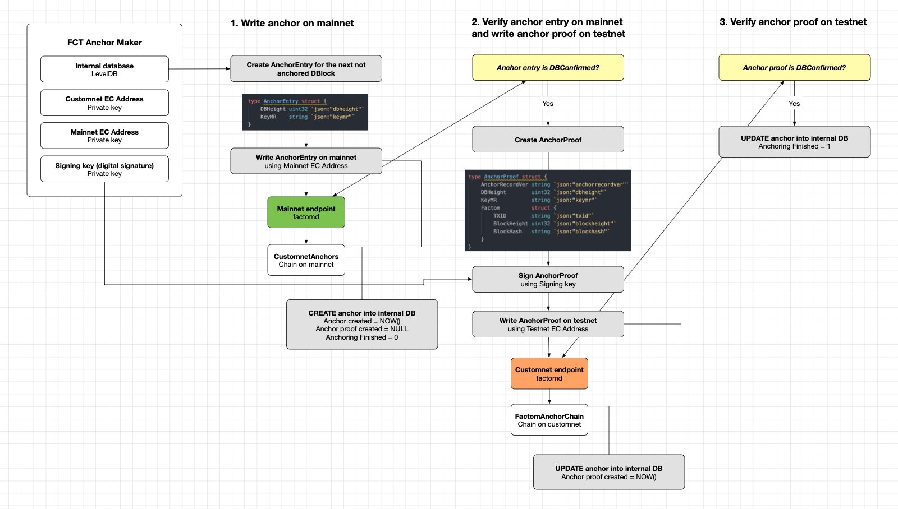

# FCT Anchormaker
Anchor custom Factom network into Factom Mainnet.

# Anchoring specification

New chain (with an arbitrary name, e.g. "DeFactoCustomnetAnchors") is created on Factom mainnet – anchors are written to this chain.
New chain is created on Factom customnet – anchor proofs are written to this chain and customnet factomd nodes will be parsing anchors from this chain to return them via factomd API.
